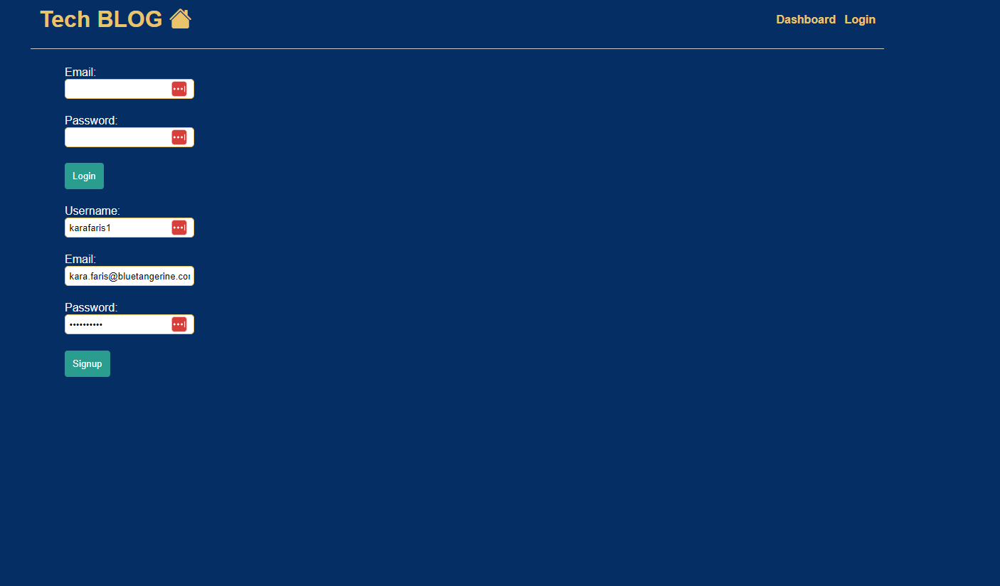
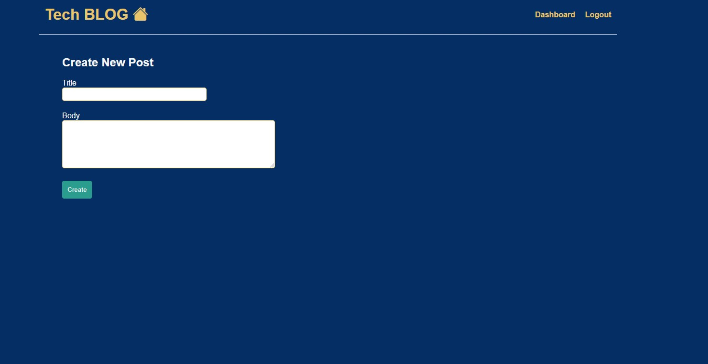
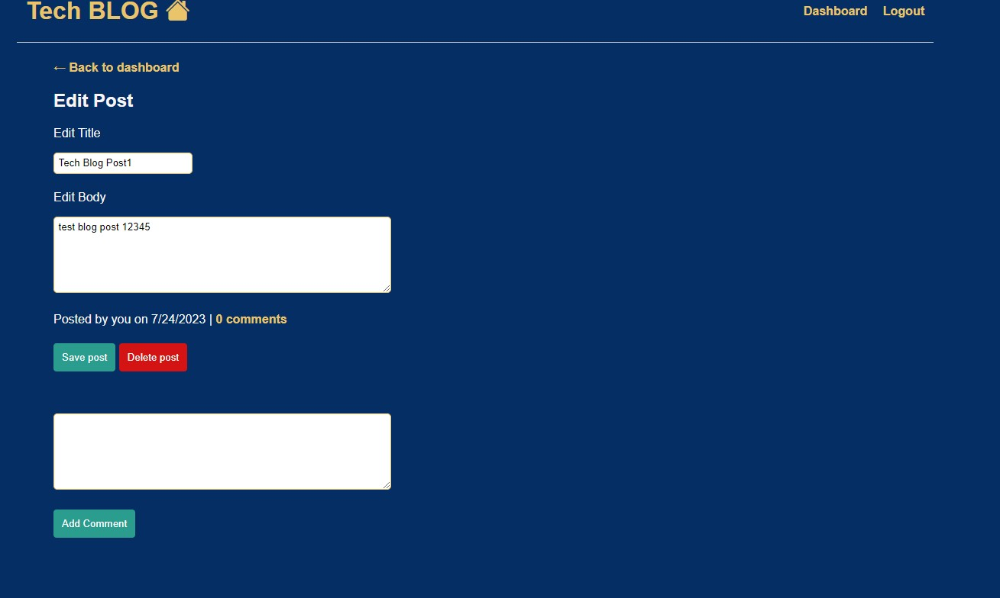
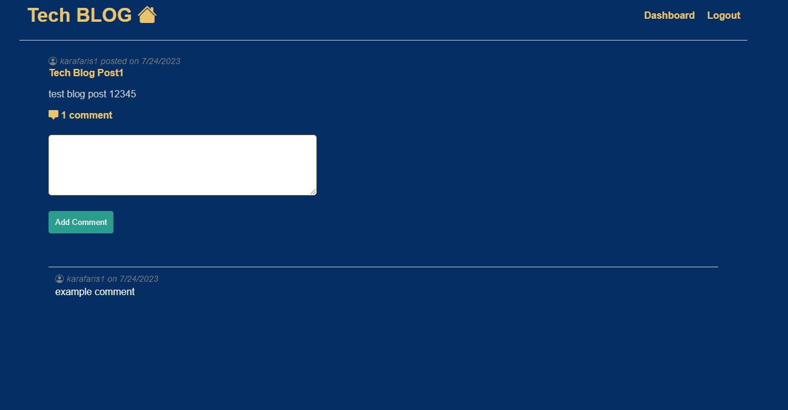

# Tech Blog


## Description
My motivation for building this project was to create a CMS-style blog site catering to developers, where they can publish blog posts and engage in discussions with peers. By following the MVC paradigm and utilizing technologies like Handlebars.js for templating, Sequelize for ORM, and express-session npm package for authentication, I aimed to solve the problem of the lack of specialized platforms for developers to share their expertise and collaborate. Through this project, I learned valuable skills in web development, MVC architecture, Handlebars.js, Sequelize, and user authentication, enhancing my overall understanding of building functional web applications.

## Table of Contents

- [Installation](#installation)
- [Usage](#usage)
- [Deployed Site](#deployed-site)
- [Screenshots](#sceenshots)
- [Tech Used](#tech-used)
- [Contact](#contributing)
- [Contributing](#contributing)
- [License](#license)


## User Story

```md
AS A developer who writes about tech
I WANT a CMS-style blog site
SO THAT I can publish articles, blog posts, and my thoughts and opinions
```
## Deployed Site
https://app-techblog-a05f9ccb1ffe.herokuapp.com/

## Screenshots





## Installation
<br />Clone the repo  <br />

<br />Use npm install to install dependecies. <br />
  `npm install` <br />
<br />Log into MySQL. <br />
  `mysql -u <user> -p ` <br />
Enter password. <br />
<br />Source the schema. <br />
  `source db/schema.sql` <br />
<br />Quit MySQL and seed the database.  <br />
  `quit
  node seeds`  <br />
<br />Start the server. <br />
  `npm start`

## Usage
Once the server is started, visit localhost:3001. Users can sign up and log in. 
Once logged in, they will have two new options in the navigation bar. `dashboard` will take them to a page where they can create a new post, view previous posts (which they can select to edit or delete), or they can select `logout` . If they do not wish to make a post they can visit other users posts by either clicking on the title or comments. 
Here the user can see all the comments for this post and they can leave one of their own. If the user wishes to return to the homepage they can click on 'Tech POST' to take them back to the home page.

## Tech Used

[express-handlebars](https://www.npmjs.com/package/express-handlebars)

[MySQL2](https://www.npmjs.com/package/mysql2) 

[Sequelize](https://www.npmjs.com/package/sequelize)

[dotenv package](https://www.npmjs.com/package/dotenv)

[bcrypt package](https://www.npmjs.com/package/bcrypt)

[express-session](https://www.npmjs.com/package/express-session)

[connect-session-sequelize](https://www.npmjs.com/package/connect-session-sequelize)

[express-session](https://www.npmjs.com/package/express-session)


## Contributing [](https://github.com)

[Github](https://github.com/karafaris/TechBlog.git)

[Email me](karafaris@icloud.com)


## License

This project is licensed under the MIT License - see the [LICENSE](LICENSE) file for details.
